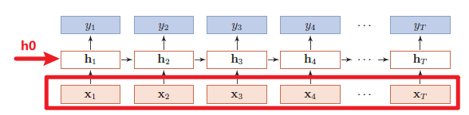
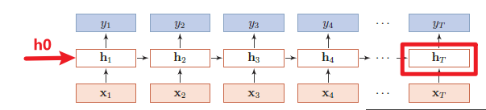

# 1.NLP学习记录

> [markdown基础语法](https://blog.csdn.net/qq_40818172/article/details/126260661?ops_request_misc=%257B%2522request%255Fid%2522%253A%2522171859450016800213011858%2522%252C%2522scm%2522%253A%252220140713.130102334..%2522%257D&request_id=171859450016800213011858&biz_id=0&utm_medium=distribute.pc_search_result.none-task-blog-2~all~top_positive~default-1-126260661-null-null.142^v100^pc_search_result_base8&utm_term=markdown&spm=1018.2226.3001.4187)

## 1.1 数据结构

> [Pytorch中RNN Layer的使用](https://blog.csdn.net/weixin_45727931/article/details/114369073)

### 1.1.1 输入输出的表示

#### 一.输入表示形式

输入如下图所示，输入主要有向量$x$,初始的$ h_0 $。其中`x:[seq_len, batch, input_size]`,`h0:[num_layers, batch,hidden_size]`。

* `seq_len`:输入序列的长度，即有多少个$ x_i $,在语言预测的任务下，即代表每批量的子序列有多长。
* `batch`  ：小批量大小。
* `input_size`:输入数据的编码维度，采用one-hot编码情况下，代表了词样本的类别数量，常见的`input_size`为28。
* `num_layers`: 隐含层的层数。
* `hidden_size`: 隐含层的维数。

#### 二.输出表示
输出如下图所示,可以由$ Y $向量或者最后一个时刻隐含层的输出$ h_t $,，如果输出是$ Y $向量,则Ｙ的结构为`out:[seq_len, batch, hidden_size]`。

如果输出是最后一个时刻隐含层的输出$h_t$,那么`h_t：:[num_layers, batch, hidden_size]`,与$h_0$一致。

### 1.1.2 RNN模块

Pytorch中RNN模块函数为`torch.nn.RNN(input_size,hidden_size,num_layers,batch_first)`,其中：

* `input_size`：输入数据的编码维度。
* `hidden_size`: 隐含层的维数。
* `num_layers`: 隐含层的层数。
