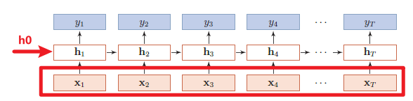
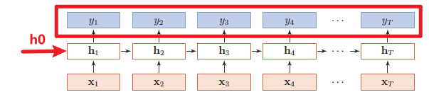
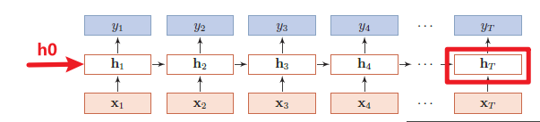
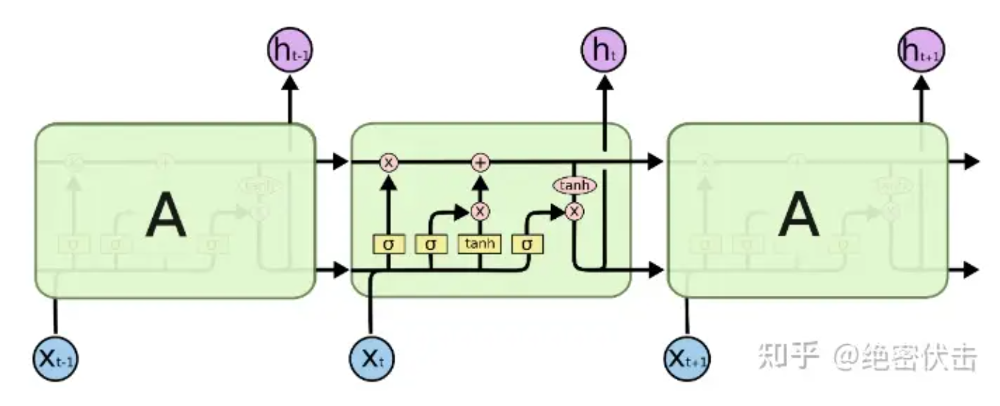
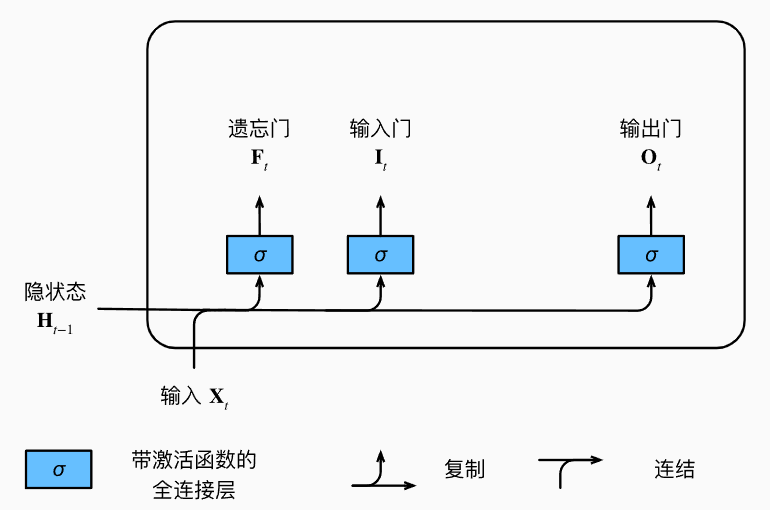
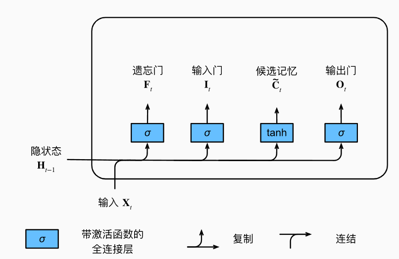
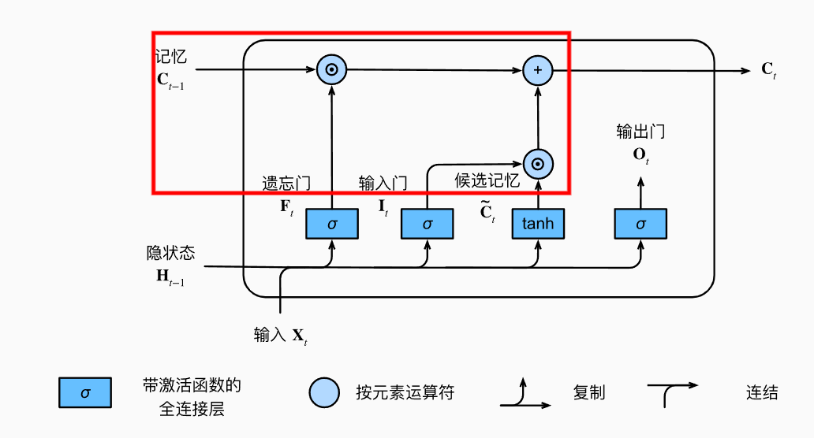
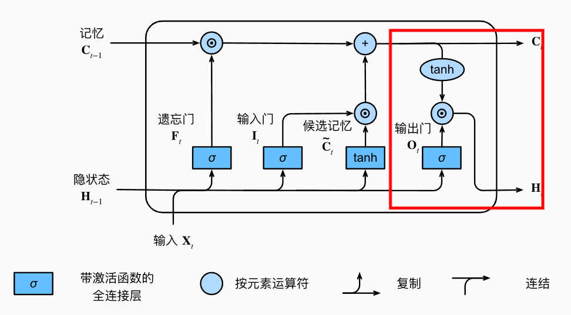
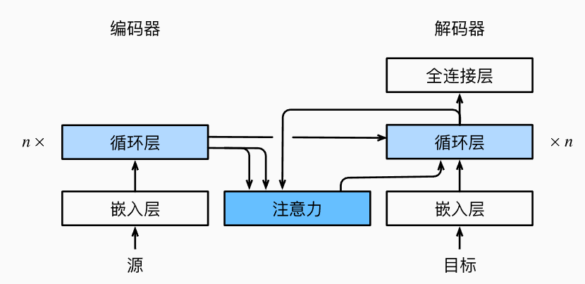

# 1.NLP学习记录

> [markdown基础语法](https://blog.csdn.net/qq_40818172/article/details/126260661?ops_request_misc=%257B%2522request%255Fid%2522%253A%2522171859450016800213011858%2522%252C%2522scm%2522%253A%252220140713.130102334..%2522%257D&request_id=171859450016800213011858&biz_id=0&utm_medium=distribute.pc_search_result.none-task-blog-2~all~top_positive~default-1-126260661-null-null.142^v100^pc_search_result_base8&utm_term=markdown&spm=1018.2226.3001.4187)

> [latex公式编辑](https://blog.csdn.net/NSJim/article/details/109045914)

## 1.1 数据结构
### 1.1.1 NLP数据集前置知识
>[词嵌入基础知识](https://blog.csdn.net/raelum/article/details/125462028?ops_request_misc=%257B%2522request%255Fid%2522%253A%2522171878239116800222817961%2522%252C%2522scm%2522%253A%252220140713.130102334..%2522%257D&request_id=171878239116800222817961&biz_id=0&utm_medium=distribute.pc_search_result.none-task-blog-2~all~top_positive~default-1-125462028-null-null.142^v100^pc_search_result_base8&utm_term=nn.Embedding&spm=1018.2226.3001.4187)

#### 一. 语料库（Corpus）
 NLP任务所依赖的语言数据称为语料库。
#### 二. 词元（Token）
假设语料库只有三个英文句子并且均已经过处理（全部小写+去掉标点符号）,示例如下：
```python
corpus = ["he is an old worker", "english is a useful tool", "the cinema is far away"]
```
往往需要将其词元化（tokenize）以成为一个序列，这里只需要简单的`split`即可：
```python
def tokenize(corpus):
    return [sentence.split() for sentence in corpus]
tokens = tokenize(corpus)
print(tokens)
# [['he', 'is', 'an', 'old', 'worker'], ['english', 'is', 'a', 'useful', 'tool'], ['the', 'cinema', 'is', 'far', 'away']]
```
#### 三.词表（Vocabulary）

词表为不重复地包含语料库中的所有词元,其用于将字符串类型的词元映射到从0开始的数字索引中。 此外语料库中不存在或已删除的任何词元都将映射到一个特定的未知词元`<unk>`。并且可以选择增加一个列表，用于保存那些被保留的词元， 例如：填充词元`<pad>`； 序列开始词元`<bos>`； 序列结束词元`<eos>`。
```python
import  collections
class Vocab:  #@save
    """文本词表"""
    def __init__(self, tokens=None, min_freq=0, reserved_tokens=None):
        if tokens is None:
            tokens = []
        if reserved_tokens is None:
            reserved_tokens = []
        # 按出现频率排序
        counter = count_corpus(tokens)
        self._token_freqs = sorted(counter.items(), key=lambda x: x[1],
                                   reverse=True)
        # 未知词元的索引为0
        self.idx_to_token = ['<unk>'] + reserved_tokens
        self.token_to_idx = {token: idx
                             for idx, token in enumerate(self.idx_to_token)}
        for token, freq in self._token_freqs:
            if freq < min_freq:
                break
            if token not in self.token_to_idx:
                self.idx_to_token.append(token)
                self.token_to_idx[token] = len(self.idx_to_token) - 1

    def __len__(self):
        return len(self.idx_to_token)

    def __getitem__(self, tokens):
        if not isinstance(tokens, (list, tuple)):
            return self.token_to_idx.get(tokens, self.unk)
        return [self.__getitem__(token) for token in tokens]

    def to_tokens(self, indices):
        if not isinstance(indices, (list, tuple)):
            return self.idx_to_token[indices]
        return [self.idx_to_token[index] for index in indices]

    @property
    def unk(self):  # 未知词元的索引为0
        return 0

    @property
    def token_freqs(self):
        return self._token_freqs
def count_corpus(tokens):  #@save
    """统计词元的频率"""
    # 这里的tokens是1D列表或2D列表
    if len(tokens) == 0 or isinstance(tokens[0], list):
        # 将词元列表展平成一个列表
        tokens = [token for line in tokens for token in line]
    return collections.Counter(tokens)
```

#### 四.词嵌入(Embedding)
embedding的作用就像一个查找表（Lookup Table）一样，通过这些索引在`weight`中查找并返回相应的词向量,其基础参数如下:
```python
nn.Embedding(num_embeddings,embedding_dim)
```
其中,`num_embeddings`是词表的**长度**,即`len(Vocab)`;`embedding_dim`是人为给定的词向量映射维度。

### 1.1.2 输入输出的表示

#### 一.输入表示形式

输入如下图所示，输入主要有向量$ x $ ,初始的 $ h_0 $。其中`x:[seq_len, batch, input_size]`,`h0:[num_layers, batch,hidden_size]`。

* `seq_len`:输入序列的长度，即有多少个$ x_i $,在语言预测的任务下，即代表每批量的子序列有多长。
* `batch`  ：小批量大小。
* `input_size`:输入数据的编码维度，采用one-hot编码情况下，代表了词样本的类别数量，常见的`input_size`为28。
* `num_layers`: 隐含层的层数。
* `hidden_size`: 隐含层的维数。



#### 二.输出表示

输出如下图所示,可以由$ Y $向量或者最后一个时刻隐含层的输出 $ h_t $，如果输出是 $ Y $向量,则 $ Y $ 的结构为`out:[seq_len, batch, hidden_size]`。



如果输出是最后一个时刻隐含层的输出$h_t$,那么`h_t：:[num_layers, batch, hidden_size]`,与$h_0$一致。




## 1.2循环神经网络
### 1.2.1 RNN模块
> [Pytorch中RNN Layer的使用](https://blog.csdn.net/weixin_45727931/article/details/114369073)
> 
Pytorch中RNN模块函数为`torch.nn.RNN(input_size,hidden_size,num_layers,batch_first)`,其中：

* `input_size`：输入数据的编码维度。
* `hidden_size`: 隐含层的维数。
* `num_layers`: 隐含层的层数。

### 1.2.2 LSTM模块

> [LSTM（长短期记忆神经网络）Pytorch实现入门](https://blog.csdn.net/weixin_61589188/article/details/130797914?ops_request_misc=%257B%2522request%255Fid%2522%253A%2522171854690216777224447297%2522%252C%2522scm%2522%253A%252220140713.130102334..%2522%257D&request_id=171854690216777224447297&biz_id=0&utm_medium=distribute.pc_search_result.none-task-blog-2~all~top_click~default-2-130797914-null-null.142^v100^pc_search_result_base8&utm_term=LSTM%20pytorch&spm=1018.2226.3001.4187)

一个简单但完整的LSTM网络包含一个LSTM层和一个全连接层，LSTM层用于处理序列数据，全连接层用于将LSTM的输出映射到所需的输出空间，例如分类或回归。其网络架构如下：


#### 一.输入门、忘记门和输出门



$$
输入门:I_t=\sigma(X_tW_{xi}+H_{t-1}W_{hi}+b_i)\\
忘记门:F_t=\sigma(X_tW_{xf}+H_{t-1}W_{hf}+b_f)\\
输出门:O_t=\sigma(X_tW_{xo}+H_{t-1}W_{ho}+b_o)
$$

#### 二. 候选记忆元

候选记忆元$ \widetilde{C}_t \in{R^{n\times{h}}}$的定义如下:

$$
\widetilde{C}=tanh(X_{t}W_{xc}+H_{t-1}W_{hc}+b_{c})
$$



#### 三. 记忆单元

在LSTM中,运用两个门用于控制序列的输入和遗忘（或跳过）:其中输入门$I_t$控制采用多少来自
$ \widetilde{C}_t $的新数据，而遗忘门$ F_t$制保留多少过去的记忆元$C_{t-1}\in R^{n\times{h}}$的内容,其数学定义如下:

$$
C_t=F_t \odot{C_{t-1}}+I_t \odot{\widetilde{C}_t}
$$

如果遗忘门$ F_t $始终为1且输入门$ I_t $始终为0,则过去的记忆元$ C_{t-1} $将随时间被保存并传递到当前时间步。


#### 四.隐状态
LSTM的隐状态$ H_t\in{R^{n\times{h}}} $ 定义如下:
$$
H_t=O_t \odot{tanh(C_t)}
$$
当输出门$O_t$接近1，LSTM就能够有效地将所有记忆信息传递给预测部分，而当输出门$O_t$接近0，LSTM只保留记忆元内的所有信息，而不需要更新隐状态。

```python
class LSTM(nn.Module):
    def __init__(self, input_size, hidden_size, num_layers, output_size):

        super().__init__()
        self.device =d2l.try_gpu()

        self.input_size = input_size
        self.hidden_size = hidden_size
        self.num_layers = num_layers
        self.output_size = output_size
        # 定义LSTM层
        self.gru = nn.GRU(input_size=input_size, hidden_size=hidden_size, num_layers=num_layers)
        self.lstm = nn.LSTM(input_size, hidden_size, num_layers)
        self.fc = nn.Linear(hidden_size, output_size)
    # 前向传播函数
    def forward(self, inputs,h0=None,c0=None):
        #h0,c0->(num_layers, batch_size, hidden_size)
        # 初始化LSTM的隐藏状态和记忆单元 intput->[step_num,batch_size,onehot_encode]
        if h0 is None and c0 is None:
            h0 = torch.zeros(self.num_layers,inputs.size(0), self.hidden_size).to(inputs.device)
            c0 = torch.zeros(self.num_layers,inputs.size(0), self.hidden_size).to(inputs.device)
        # 通过LSTM层进行前向传播
        inputs = torch.nn.functional.one_hot(inputs.T.long(), 28).type(torch.float32)
        output, (hn, cn) = self.lstm(inputs, (h0, c0))

        # # 取LSTM最后一个时间步的输出作为全连接层的输入
        # output = output[-1, :, :]
        # 将LSTM的输出传入全连接层进行前向传播
        output = self.fc(output)
        return output, hn, cn
```

lstm训练300epoch总计时长101.7s,
## 2 Attention注意力机制
### 2.1嵌入Attention的seq2seq(Bahdanau注意力)
* Attention的key和value为**seq2seq编码器所有token_embedding的输出**。
* Attention的query为**seq2seq解码器RNN上一个时序token_embedding的输出**。
* Attention的输出和下一个token嵌入拼接后,输入下一轮的**Decoder_RNN**。
* 注意力机制可以**根据Decoder_RNN的输出来匹配到合适的Encoder_RNN的输出**来更有效传递信息。
* 
```python
class Seq2SeqAttentionDecoder(AttentionDecoder):
    def __init__(self, vocab_size, embed_size, num_hiddens, num_layers,
                 dropout=0, **kwargs):
        super(Seq2SeqAttentionDecoder, self).__init__(**kwargs)
        self.attention = d2l.AdditiveAttention(
            num_hiddens, dropout)
        self.embedding = nn.Embedding(vocab_size, embed_size)
        self.rnn = nn.GRU(
            embed_size + num_hiddens, num_hiddens, num_layers,
            dropout=dropout)
        self.dense = nn.Linear(num_hiddens, vocab_size)
    # outputs的形状为(batch_size，num_steps，num_hiddens).
    # hidden_state的形状为(num_layers，batch_size，num_hiddens)
    def init_state(self, enc_outputs, enc_valid_lens, *args):
        outputs, hidden_state = enc_outputs
        return (outputs.permute(1, 0, 2), hidden_state, enc_valid_lens)
    def forward(self, X, state):
        # enc_outputs的形状为(batch_size,num_steps,num_hiddens).
        # hidden_state的形状为(num_layers,batch_size, num_hiddens)
        enc_outputs, hidden_state, enc_valid_lens = state
        # 输出X的形状为(num_steps,batch_size,embed_size)
        X = self.embedding(X).permute(1, 0, 2)
        outputs, self._attention_weights = [], []
        for x in X:
            # query的形状为(batch_size,1,num_hiddens)
            query = torch.unsqueeze(hidden_state[-1], dim=1)
            # context的形状为(batch_size,1,num_hiddens)
            context = self.attention(
                query, enc_outputs, enc_outputs, enc_valid_lens)
            # 在特征维度上连结
            x = torch.cat((context, torch.unsqueeze(x, dim=1)), dim=-1)
            # 将x变形为(1,batch_size,embed_size+num_hiddens)
            out, hidden_state = self.rnn(x.permute(1, 0, 2), hidden_state)
            outputs.append(out)
            self._attention_weights.append(self.attention.attention_weights)
        # 全连接层变换后，outputs的形状为
        # (num_steps,batch_size,vocab_size)
        outputs = self.dense(torch.cat(outputs, dim=0))
        return outputs.permute(1, 0, 2), [enc_outputs, hidden_state,
                                          enc_valid_lens]
    @property
    def attention_weights(self):
        return self._attention_weights
```
